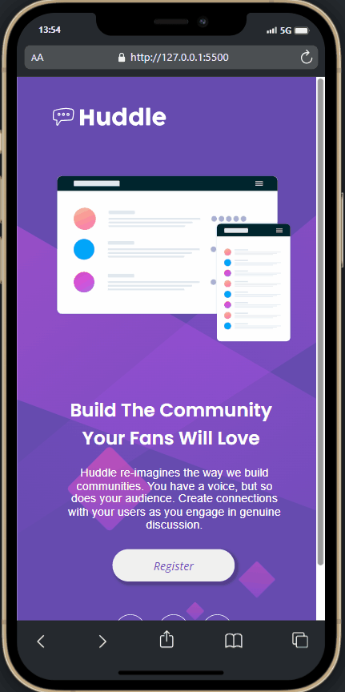
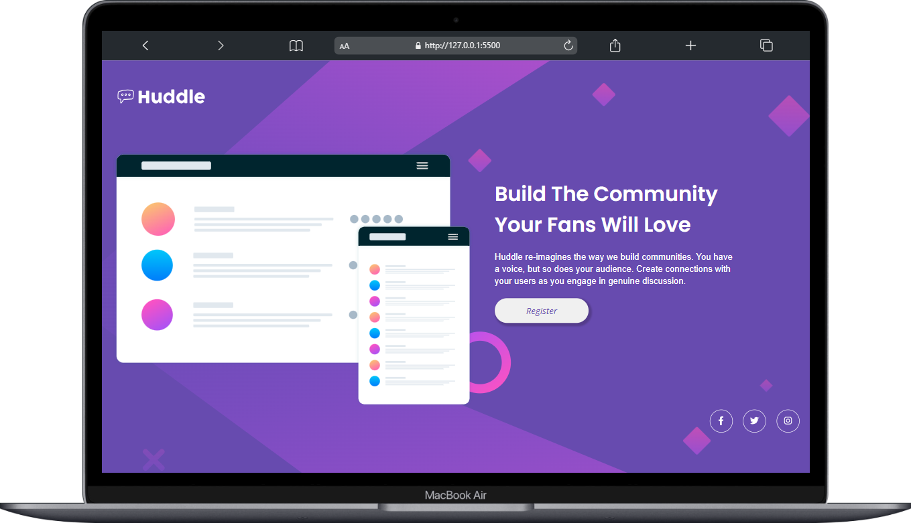
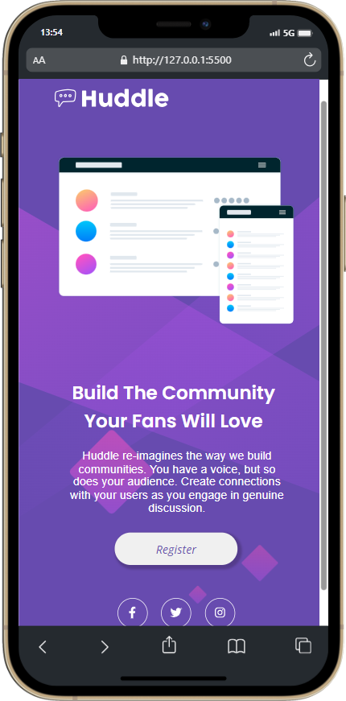

#  Página Inicial Huddble 💻

## Visão Geral 👀
Bem-vindo ao Huddble, uma página inicial visualmente deslumbrante criada como parte do exercício Frontend Mentor no curso DevQuest. 🚀

##  Descrição do Projeto 🌐
O Huddble é uma página inicial responsiva construída exclusivamente com HTML e CSS, utilizando o modelo de layout Flexbox. Este projeto foi uma jornada de desafios e triunfos, proporcionando insights valiosos no desenvolvimento frontend 👩‍💻

## Objetivo 🎯
O objetivo principal do projeto Huddble é criar uma página inicial visualmente atraente e responsiva, demonstrando habilidades fundamentais de desenvolvimento frontend utilizando HTML e CSS, com ênfase no uso do modelo de layout Flexbox. Este projeto foi concebido como parte do exercício Frontend Mentor no âmbito do curso DevQuest, visando alcançar os seguintes objetivos específicos:

1. Desenvolvimento Responsivo
O foco principal é garantir que a página inicial do Huddble seja acessível e ofereça uma experiência de usuário consistente em uma variedade de dispositivos, incluindo desktops, tablets e smartphones. A responsividade é essencial para atender às expectativas modernas de navegação na web.

2. Maestria em Flexbox
A utilização extensiva do modelo de layout Flexbox é um ponto-chave do projeto. O objetivo é demonstrar um entendimento aprofundado e habilidades práticas na aplicação do Flexbox para criar um design eficiente e flexível, permitindo uma disposição harmoniosa dos elementos na página.

3. Experiência de Aprendizado Pessoal
Além dos objetivos técnicos, o projeto Huddble visa proporcionar uma experiência de aprendizado significativa. Enfrentar desafios durante o desenvolvimento, aprender com a comunidade e aplicar conhecimentos adquiridos são aspectos fundamentais para o crescimento pessoal e profissional

## Aprendizados e Reflexões 🧠 
🌱 Crescimento: Este exercício proporcionou oportunidades substanciais de crescimento, aprimorando a proficiência em HTML e CSS. Cada desafio foi uma oportunidade de aprender e melhorar.

💡 Resolução de Problemas: Superar dificuldades na criação da imagem de fundo demonstrou habilidades de resolução de problemas. O processo de tentativa e erro levou a um resultado bem-sucedido.

🤝 Comunidade: Participar de exercícios do Frontend Mentor como parte do curso DevQuest permitiu colaboração dentro da comunidade, aprendizado com colegas e compartilhamento de experiências.

## Futuras Melhorias 💻
O aprendizado nunca para, Futuras melhorias incluirão otimizações de desempenho, integração de animações e expansão das funcionalidades.

## Gratidão aos Gêmeos e ao DevQuest 🙌
Agradecimentos especiais ao curso DevQuest e ao Frontend Mentor por proporcionarem um ambiente de aprendizado enriquecedor. O conhecimento adquirido neste exercício, sem dúvida, contribuirá para projetos e empreendimentos futuros.

Sinta-se à vontade para explorar a página inicial Huddble e vivenciar a fusão de criatividade e expertise em codificação! ✨

## Preview Gif 🎥
Dê um play e veja a mágica acontecer na landing page da Agência XYZ! Transformação rápida, com destaque para o menu hamburguer. 🌟

## Preview Desktop 🖥️ 📸
Visualize o Card Component em todo o seu desktop!

## Preview Mobile 📱 📸
Desfrute da experiência responsiva do Card Component em dispositivos móveis.

## Personalização 🎨
Sinta-se à vontade para Você modificar o projeto de Huddble Landing Page, adicionar mais funcionalidades ou integrá-lo a outras tecnologias.

## Tecnologias Utilizadas  💻

## Contribuição 🤝
Contribuições são bem-vindas! Sinta-se à vontade para propor melhorias, correções de bugs ou novos recursos. 🚀

### Agradeço por conferir meu projeto! Espero que este projeto de landing page tenha sido tão emocionante para você quanto foi para mim. Se tiver dúvidas ou sugestões, sinta-se à vontade para entrar em contato.

#### Divirta-se codificando! 😊 

## Contato 📲

### me segue nas redes abaixo!
 

   
  
  
  

